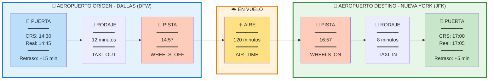
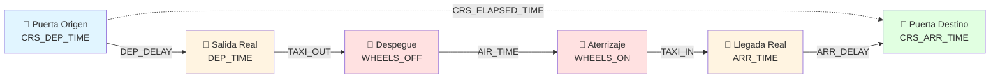
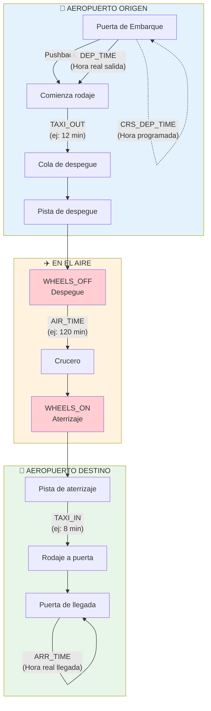

# Ejemplo simple

```mermaid
graph LR
    subgraph ORIGEN["🏢 AEROPUERTO ORIGEN - DALLAS (DFW)"]
        G1["🚪 PUERTA<br/>━━━━━━━<br/>CRS: 14:30<br/>Real: 14:45<br/>━━━━━━━<br/>Retraso: +15 min"]
        T1["🚗 RODAJE<br/>━━━━━━━<br/>12 minutos<br/>━━━━━━━<br/>TAXI_OUT"]
        R1["🛫 PISTA<br/>━━━━━━━<br/>14:57<br/>━━━━━━━<br/>WHEELS_OFF"]
    end
    
    subgraph AIRE["☁️ EN VUELO"]
        A1["✈️ AIRE<br/>━━━━━━━<br/>120 minutos<br/>━━━━━━━<br/>AIR_TIME"]
    end
    
    subgraph DESTINO["🏢 AEROPUERTO DESTINO - NUEVA YORK (JFK)"]
        R2["🛬 PISTA<br/>━━━━━━━<br/>16:57<br/>━━━━━━━<br/>WHEELS_ON"]
        T2["🚗 RODAJE<br/>━━━━━━━<br/>8 minutos<br/>━━━━━━━<br/>TAXI_IN"]
        G2["🚪 PUERTA<br/>━━━━━━━<br/>CRS: 17:00<br/>Real: 17:05<br/>━━━━━━━<br/>Retraso: +5 min"]
    end
    
    G1 --> T1
    T1 --> R1
    R1 --> A1
    A1 --> R2
    R2 --> T2
    T2 --> G2
    
    style ORIGEN fill:#e3f2fd,stroke:#1976d2,stroke-width:3px
    style AIRE fill:#fff3e0,stroke:#f57c00,stroke-width:3px
    style DESTINO fill:#e8f5e9,stroke:#388e3c,stroke-width:3px
    style G1 fill:#bbdefb
    style G2 fill:#c8e6c9
    style R1 fill:#ffccbc
    style R2 fill:#ffccbc
    style A1 fill:#ffe082
```

# Diagrama Timeline

```mermaid
graph LR
    A[🚪 Puerta Origen<br/>CRS_DEP_TIME] -->|DEP_DELAY| B[🚪 Salida Real<br/>DEP_TIME]
    B -->|TAXI_OUT| C[🛫 Despegue<br/>WHEELS_OFF]
    C -->|AIR_TIME| D[🛬 Aterrizaje<br/>WHEELS_ON]
    D -->|TAXI_IN| E[🚪 Llegada Real<br/>ARR_TIME]
    A -.->|CRS_ELAPSED_TIME| F[🚪 Puerta Destino<br/>CRS_ARR_TIME]
    E -->|ARR_DELAY| F
    
    style A fill:#e1f5ff
    style B fill:#fff4e1
    style C fill:#ffe1e1
    style D fill:#ffe1e1
    style E fill:#fff4e1
    style F fill:#e1ffe1
```

# Diagrama Fases

```mermaid
graph TD
    subgraph Aeropuerto_Origen["🏢 AEROPUERTO ORIGEN"]
        A1[Puerta de Embarque] -->|"Pushback"| A2[Comienza rodaje]
        A2 -->|"TAXI_OUT<br/>(ej: 12 min)"| A3[Cola de despegue]
        A3 --> A4[Pista de despegue]
    end
    
    subgraph Vuelo["✈️ EN EL AIRE"]
        B1[WHEELS_OFF<br/>Despegue] -->|"AIR_TIME<br/>(ej: 120 min)"| B2[Crucero]
        B2 --> B3[WHEELS_ON<br/>Aterrizaje]
    end
    
    subgraph Aeropuerto_Destino["🏢 AEROPUERTO DESTINO"]
        C1[Pista de aterrizaje] -->|"TAXI_IN<br/>(ej: 8 min)"| C2[Rodaje a puerta]
        C2 --> C3[Puerta de llegada]
    end
    
    A1 -.->|"CRS_DEP_TIME<br/>(Hora programada)"| A1
    A1 -->|"DEP_TIME<br/>(Hora real salida)"| A2
    A4 --> B1
    B3 --> C1
    C3 -.->|"CRS_ARR_TIME<br/>(Hora programada)"| C3
    C3 -->|"ARR_TIME<br/>(Hora real llegada)"| C3
    
    style Aeropuerto_Origen fill:#e3f2fd
    style Vuelo fill:#fff3e0
    style Aeropuerto_Destino fill:#e8f5e9
    style B1 fill:#ffcdd2
    style B3 fill:#ffcdd2
```