# Problemática a resolver
En la aviación mexicana uno de los problemas más comunes que se presentan en las malas calificaciones de Google maps es el retraso de los vuelos. Estos eventos son sorpresa para las aereolíneas, haciendo un problema de difícil detección. Un problema grande para las aereolíneas es que la generación de horarios de vuelo se hacen con tiempo de anticipación, por lo que preveer retrasos a futuro resulta aún más complicado mientras la ventana de tiempo crece.

# Justificación 
¿Por qué usar un modelo supervisado para resolver esa problemática?

Poder predecir la probabilidad de que un vuelo se atrase es un problema de modelación supervisada dicotómica, donde 1 representa una salida con atraso y 0 una salida a tiempo.

# Resumen de EDA (Principales Insights [más enfocados a negocio])

## Etapas de vuelo 
El porcentaje promedio estimado en las 3 etapas del vuelo son las siguientes
* Taxi out: 15.9%
* Flith time: 76.6%
* Taxi in: 6.6%

## Problemas técnicos
Cancelaciones menores al 5%
Redirección de vuelo a otros aereopuertos menos del 1%
Cada ruta (combinación Aereopuerto Origen y Aereopuerto Destino) representanta menos del 0.5% de los viajes

## Retrasos de salida y llegada
El escenario promedio de salida tiene un retraso de 18 minutos, con una desviación estándar de 22 minutos

El escenario promedio de llegada tiene una llegada temprana de 1 minuto, con una desviación de 26 minutos 

## Recuperación de tiempo 
Cuando el tiempo de vuelo real es menor que el tiempo estimado (minutos entre hora asignada de salida y hora asignada de llegada) es independiente del retraso que puede tener un vuelo, ya que podría iniciar tarde y tardar menos del estimado, terminando el vuelo con retraso, pero mejor al inicial.
Vuelos con tiempo real menor al esperado es del 22.4%

## Aerolíneas 
A pesar de que existen 10 aerolíneas que venden tickets de vuelo, son 21 aerolíneas las que operan.

## Eventos relevantes 
Los porcentajes de eventos de interés son:

|||
|--|--|
| Salida tardía (+15 min después de lo agendado) | 17% |
| Salida temprana (+5 min antes de lo agendado) | 31.6% |
| Llegada tardía (+15 min después de lo agendado) | 17.9% |
| Llegada tardía severa (+60 min después de lo agendado) | 6.2% |
| Llegada tempranoa (+5 min antes de lo agendado) | 54.1% |
| Taxi out largo (Taxi out mayor al percentil .75 general) | 23.5% |
| Vuelo rápido (Tiempo total de vuelo menor al tiempo total agendado) | 7.2% |
| Problemas operacionales (cancelaciones y desviaciones de aterrizajes) | 3.3% |

# Métricas del Modelo (Debe existir una comparativa entre los modelos)

Con las variables construidas se probaron los modelos RandomForestClassifier, DecisionTreeClasifier, AdaBoostClassifier, LogisticRegression, KNeighborsClassifier estás fueron las métricas obtenidas:

      
      model
      best_params
      classification_report
      roc_auc
    
      0
      RandomForestClassifier
      {'n_estimators': 100, 'min_samples_split': 5, ...
      {'0': {'precision': 0.8641083521444696, 'recal...
      0.622443
    
    
      1
      DecisionTreeClassifier
      {'min_samples_split': 10, 'min_samples_leaf': ...
      {'0': {'precision': 0.8127570789865872, 'recal...
      0.618876
    
    
      2
      AdaBoostClassifier
      {'n_estimators': 50, 'learning_rate': 0.5}
      {'0': {'precision': 0.8126638074815344, 'recal...
      0.618627
    
    
      3
      LogisticRegression
      {'solver': 'lbfgs', 'penalty': 'l2', 'class_we...
      {'0': {'precision': 0.8601522002867542, 'recal...
      0.614568
    
    
      4
      KNeighborsClassifier
      {'weights': 'uniform', 'n_neighbors': 7, 'metr...
      {'0': {'precision': 0.8163967231567757, 'recal...
      0.565083

# Criterios de selección del mejor modelo bien justificada; con sus respectivos hiperparametros (tuneados).
A pesar de que el mejor modelo es un RandomForestClassifier, por simplicidade de interpretación y mejor calibración de probabilidad LogisticRegression es un modelo más atractivo para una mejor aceptación en aviación, ya que es un sector que cuida mucho la seguridad de sus pasajeros y por ende un sector más conservador en todo sentido.

Los hiperparametros usados fueron:

El resultado de las betas del modelo son las siguientes:

Con la interpretación:

# Reporte de estabilidad de los modelos (Considerar un periodo/conjunto OOT, donde se vean los criterios de PSI, CSI,) [Clasificación] (KS entre la distribución de 1s y 0s, TE/TNE)

Para conocer la estabilidad de un mes siguiente, se consideran PSI, CSI, KS entre distribuciones de las probabilidades de valores en variable objetivo.

PSI

CSI

KS

Calibración (percentil vs probabilidad)

# Caso de uso del modelo (Cómo se implementaría, desde el enfoque del usuario final) [Criterio de selección del punto de corte o partición de la distribución de probabilidades para las estrategias]

El usuario final de este modelo el equipo operativo de una aereolínea, el cuál planearía estrategias acorde a la probabilidad de un retraso, lo cual genera incertidumbre en los usuarios y abruma al personal presencial.

El flujo de uso es el siguiente:

1. Predicción con un mes de anticipación:
    * Horario de vuelos del mes siguiente
    * Histórico operacional hasta el mes anterior

2. Resultados:
    * Score de probabilidad de retraso por vuelo (0.0 – 1.0)
    * Categoría de riesgo: BAJO / MEDIO / ALTO / CRÍTICO

3. Planeación estratégica:
    * Priorizar acciones preventivas de comunicación 
    * Asignación de personal para atender a usuarios presencialmente
    * Configuración de mensajes en aplicaciones de usuarios para mejorar transparencia

# Interpretability (Shap Values)

# Anexos

## Fases de un Vuelo

### 1. **En la Puerta de Salida (Origin Gate)**

**CRS_DEP_TIME** (Hora Programada de Salida)
- La hora a la que el vuelo *debería* salir de la puerta según el itinerario
- Ejemplo: 14:30 (2:30 PM)

**DEP_TIME** (Hora Real de Salida)
- La hora a la que el avión realmente se aleja de la puerta
- Ejemplo: 14:45 (2:45 PM) → hay un retraso de 15 minutos

**DEP_DELAY** (Retraso de Salida)
- Diferencia entre la hora programada y real
- Ejemplo: 15 minutos (valores negativos = salida temprana)

---

### 2. **Rodaje de Salida (Taxi Out)**

**TAXI_OUT** (Tiempo de Rodaje de Salida)
- Tiempo que el avión tarda rodando desde la puerta hasta la pista de despegue
- Incluye: esperas en cola, maniobras en el aeropuerto
- Ejemplo: 12 minutos

**WHEELS_OFF** (Hora de Despegue)
- Momento exacto en que el avión despega y las ruedas dejan el suelo
- Ejemplo: 14:57

---

### 3. **En el Aire (Air Time)**

**AIR_TIME** (Tiempo de Vuelo)
- Tiempo que el avión pasa en el aire, desde despegue hasta aterrizaje
- No incluye rodaje
- Ejemplo: 120 minutos (2 horas)

---

### 4. **Aterrizaje y Rodaje de Llegada**

**WHEELS_ON** (Hora de Aterrizaje)
- Momento exacto en que las ruedas del avión tocan la pista
- Ejemplo: 16:57

**TAXI_IN** (Tiempo de Rodaje de Llegada)
- Tiempo que el avión tarda rodando desde la pista hasta la puerta
- Ejemplo: 8 minutos

---

### 5. **En la Puerta de Llegada (Destination Gate)**

**CRS_ARR_TIME** (Hora Programada de Llegada)
- La hora a la que el vuelo *debería* llegar a la puerta según el itinerario
- Ejemplo: 17:00 (5:00 PM)

**ARR_TIME** (Hora Real de Llegada)
- La hora a la que el avión realmente llega a la puerta
- Ejemplo: 17:05 (5:05 PM)

**ARR_DELAY** (Retraso de Llegada)
- Diferencia entre la hora programada y real de llegada
- Ejemplo: 5 minutos

---

## Tiempos Totales

**CRS_ELAPSED_TIME** (Tiempo Total Programado)
- Tiempo total programado desde salida de la puerta origen hasta llegada a la puerta destino
- CRS_ARR_TIME - CRS_DEP_TIME
- Ejemplo: 150 minutos (2.5 horas)

**ACTUAL_ELAPSED_TIME** (Tiempo Total Real)
- Tiempo total real desde salida de la puerta origen hasta llegada a la puerta destino
- ARR_TIME - DEP_TIME
- Ejemplo: 140 minutos

## Ejemplo Práctico

**Vuelo: AA 1234 de Dallas (DFW) a Nueva York (JFK)**

| Métrica | Valor | Nota |
|---------|-------|------|
| CRS_DEP_TIME | 14:30 | Salida programada |
| DEP_TIME | 14:45 | Salida real (15 min tarde) |
| TAXI_OUT | 12 min | Rodaje a pista |
| WHEELS_OFF | 14:57 | Despegue |
| AIR_TIME | 120 min | Tiempo volando |
| WHEELS_ON | 16:57 | Aterrizaje |
| TAXI_IN | 8 min | Rodaje a puerta |
| ARR_TIME | 17:05 | Llegada real a puerta |
| CRS_ARR_TIME | 17:00 | Llegada programada |
| ARR_DELAY | 5 min | Llegada 5 min tarde |

**Nota**: Aunque salió 15 minutos tarde, solo llegó 5 minutos tarde porque el vuelo fue más rápido de lo programado.

## Ejemplo visual

```mermaid
graph LR
    subgraph ORIGEN["🏢 AEROPUERTO ORIGEN - DALLAS (DFW)"]
        G1["🚪 PUERTA<br/>━━━━━━━<br/>CRS: 14:30<br/>Real: 14:45<br/>━━━━━━━<br/>Retraso: +15 min"]
        T1["🚗 RODAJE<br/>━━━━━━━<br/>12 minutos<br/>━━━━━━━<br/>TAXI_OUT"]
        R1["🛫 PISTA<br/>━━━━━━━<br/>14:57<br/>━━━━━━━<br/>WHEELS_OFF"]
    end
    
    subgraph AIRE["☁️ EN VUELO"]
        A1["✈️ AIRE<br/>━━━━━━━<br/>120 minutos<br/>━━━━━━━<br/>AIR_TIME"]
    end
    
    subgraph DESTINO["🏢 AEROPUERTO DESTINO - NUEVA YORK (JFK)"]
        R2["🛬 PISTA<br/>━━━━━━━<br/>16:57<br/>━━━━━━━<br/>WHEELS_ON"]
        T2["🚗 RODAJE<br/>━━━━━━━<br/>8 minutos<br/>━━━━━━━<br/>TAXI_IN"]
        G2["🚪 PUERTA<br/>━━━━━━━<br/>CRS: 17:00<br/>Real: 17:05<br/>━━━━━━━<br/>Retraso: +5 min"]
    end
    
    G1 --> T1
    T1 --> R1
    R1 --> A1
    A1 --> R2
    R2 --> T2
    T2 --> G2
    
    style ORIGEN fill:#e3f2fd,stroke:#1976d2,stroke-width:3px
    style AIRE fill:#fff3e0,stroke:#f57c00,stroke-width:3px
    style DESTINO fill:#e8f5e9,stroke:#388e3c,stroke-width:3px
    style G1 fill:#bbdefb
    style G2 fill:#c8e6c9
    style R1 fill:#ffccbc
    style R2 fill:#ffccbc
    style A1 fill:#ffe082
```

